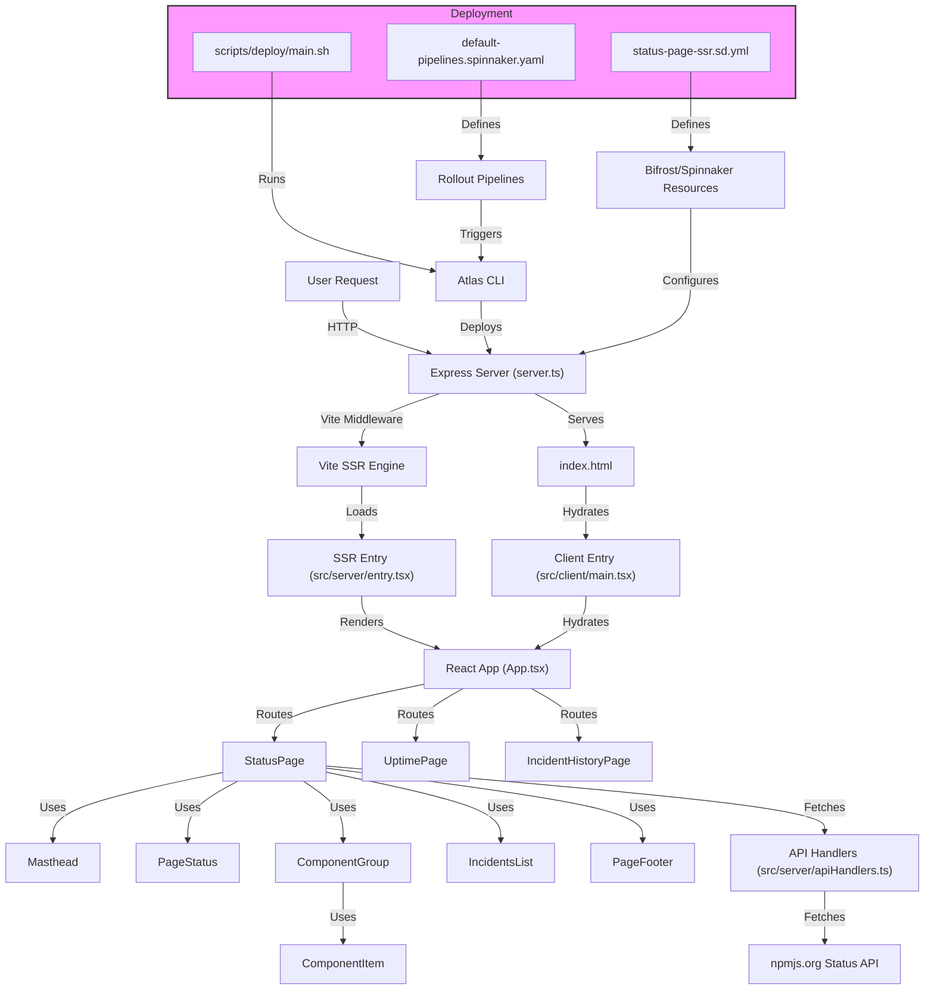

# SSR Status Page Documentation

## Architecture Diagram



---

# Table of Contents

- [Project Purpose](#project-purpose)
- [Architecture Overview](#architecture-overview)
- [File & Folder Structure](#file--folder-structure)
- [SSR Flow: Step-by-Step](#ssr-flow-step-by-step)
- [React Components: Detailed Breakdown](#react-components-detailed-breakdown)
- [Backend/API Logic](#backendapi-logic)
- [Configuration Files](#configuration-files)
- [Deployment Pipeline](#deployment-pipeline)
- [Local Development & Debugging](#local-development--debugging)
- [Extensibility & Customization](#extensibility--customization)
- [Security, Error Handling, and Edge Cases](#security-error-handling-and-edge-cases)
- [External Integrations](#external-integrations)
- [Conventions & Best Practices](#conventions--best-practices)
- [Reading & Extending the Architecture Diagram](#reading--extending-the-architecture-diagram)

---

## Project Purpose

This project is a **server-side rendered (SSR) React application** for monitoring and displaying the real-time status of NPM API endpoints, including system components, incidents, and uptime. It is designed as a playground for the Volt project, using modern web technologies and Atlassian's deployment infrastructure. The goal is to:

- Provide a robust, extensible, and observable status page for NPM services.
- Demonstrate SSR with React, Vite, and Express.
- Serve as a reference for integrating Atlassian Pillar, Bifrost, and modern deployment pipelines.

---

## Architecture Overview

- **SSR-first:** All pages are rendered on the server for fast first paint and SEO.
- **React + Vite:** Modern React app, bundled and SSR-enabled by Vite.
- **Express Server:** Handles all HTTP requests, integrates Vite as middleware.
- **API Integration:** Fetches live data from npmjs.org status API.
- **Hydration:** Client-side React takes over after SSR for interactivity.
- **Deployment:** Uses Atlassian Bifrost and Spinnaker for robust, automated deployment.

See the [Architecture Diagram](#architecture-diagram) above for a visual overview.

---

## File & Folder Structure

```
.
├── src/
│   ├── App.tsx                # Main React app with routing
│   ├── client/                # Client-side entry for hydration
│   ├── components/            # UI components (Masthead, Status, Incidents, etc.)
│   ├── pages/                 # Page-level React components (Status, Uptime, Incident History)
│   ├── server/                # SSR entry and API handlers
│   └── entry-fs/              # SSR entry templates
├── plugins/                   # Example service plugins for Pillar
├── scripts/                   # Deployment and environment scripts
├── server.ts                  # Express server with Vite middleware for SSR
├── index.html                 # HTML template for SSR
├── pillar.config.ts           # Pillar configuration (SSR, plugins)
├── vite.config.ts             # Vite build and SSR config
├── status-page-ssr.sd.yml     # Bifrost/Spinnaker deployment descriptor
├── default-pipelines.spinnaker.yaml # Spinnaker pipeline config
├── tsconfig*.json             # TypeScript configs
├── tailwind.config.js         # TailwindCSS config
├── package.json, yarn.lock    # Node dependencies
└── README.md                  # Main project documentation
```

### Folder-by-Folder Breakdown

- **src/**: All source code.
  - **App.tsx**: Main React app, sets up routing.
  - **client/**: Client-side entry (`main.tsx`) for hydration.
  - **components/**: All UI building blocks (see [React Components](#react-components-detailed-breakdown)).
  - **pages/**: Top-level pages (Status, Uptime, Incident History).
  - **server/**: SSR entry (`entry.tsx`) and API handlers (`apiHandlers.ts`).
  - **entry-fs/**: SSR entry templates (used by Pillar/Bifrost).
- **plugins/**: Example plugins for Atlassian Pillar (e.g., dummy-service-plugin.ts).
- **scripts/**: Shell scripts for deployment and environment setup.
- **server.ts**: Express server entry point, integrates Vite for SSR.
- **index.html**: HTML template for SSR output and hydration.
- **pillar.config.ts**: Configures SSR, logging, and plugins for Pillar.
- **vite.config.ts**: Vite build and SSR configuration.
- **status-page-ssr.sd.yml**: Bifrost/Spinnaker deployment descriptor.
- **default-pipelines.spinnaker.yaml**: Spinnaker pipeline config.
- **tsconfig*.json**: TypeScript project configs.
- **tailwind.config.js**: TailwindCSS config.
- **package.json, yarn.lock**: Node dependencies and lockfile.

---

## SSR Flow: Step-by-Step

1. **Server Startup**
   - `server.ts` starts an Express server.
   - Vite is started in middleware mode for SSR and hot reloading.

2. **Request Handling**
   - All HTTP requests are routed through Express.
   - The server reads `index.html` as the base template.
   - Vite applies HTML transforms (e.g., injecting scripts, styles).
   - The SSR entry (`src/server/entry.tsx`) is loaded dynamically.

3. **SSR Rendering**
   - The `render` function in `src/server/entry.tsx` uses `renderToString` from `react-dom/server` and `StaticRouter` from `react-router-dom/server` to render the React app to HTML.
   - The rendered HTML replaces the `<!--ssr-outlet-->` placeholder in `index.html`.
   - If SSR fails, a fallback client-side rendered shell is served.

4. **Client Hydration**
   - The client-side entry (`src/client/main.tsx`) hydrates the React app using `hydrateRoot` and `BrowserRouter`.
   - This enables full interactivity and routing on the client.

5. **Data Fetching**
   - API handlers in `src/server/apiHandlers.ts` fetch live data from npmjs.org status API.
   - Data is passed as props to React components during SSR and re-fetched on the client as needed.

6. **Error Handling**
   - SSR errors are logged and a fallback UI is rendered.
   - API errors are caught and displayed in the UI with retry options.

---

## React Components: Detailed Breakdown

### App.tsx
- **Role:** Main entry point for the React app. Sets up routing using `react-router-dom`.
- **Routes:**
  - `/` → `StatusPage`
  - `/statuspage/uptime` → `UptimePage`
  - `/statuspage/incident-history` → `IncidentHistoryPage`

### StatusPage.tsx
- **Role:** Main status dashboard. Fetches and displays:
  - System components (grouped and nested)
  - Unresolved incidents
  - Overall system status
- **Data Flow:**
  - Calls `fetchSummary()` and `fetchUnresolvedIncidents()` from API handlers.
  - Uses `nestComponents()` to build a tree structure for display.
  - Passes data to child components: `Masthead`, `PageStatus`, `ComponentGroup`, `IncidentsList`, `PageFooter`.
- **UI Responsibilities:**
  - Shows loading and error states.
  - Auto-refreshes data every 30 seconds.

### ComponentGroup.tsx & ComponentItem.tsx
- **Role:** Display groups of components and their statuses, supporting nested (hierarchical) components.
- **Props:**
  - `name`, `components`, `isExpanded` (for groups)
  - `id`, `name`, `status`, `description`, `uptime`, `children` (for items)
- **UI:**
  - Collapsible groups, status badges, tooltips for descriptions, uptime display.

### IncidentsList.tsx
- **Role:** Groups and displays incidents by month/year, showing details and updates.
- **Props:**
  - `incidents`, `title`, `showResolved`
- **UI:**
  - Lists incidents, groups by month, shows impact and update history.

### Masthead.tsx
- **Role:** Header with navigation and a modal for subscribing to updates.
- **UI:**
  - Navigation links, branding, "Subscribe to Updates" button.

### SubscribeModal.tsx
- **Role:** Modal dialog for subscribing to status updates via Email, SMS, Twitter, Support, or RSS.
- **Props:**
  - `open`, `onClose`
- **UI:**
  - Tabbed interface for different subscription methods.

### PageFooter.tsx
- **Role:** Footer with branding and project info.

---

## Backend/API Logic

### src/server/apiHandlers.ts
- **Purpose:** All backend data fetching and transformation for the frontend.
- **Data Models:**
  - `StatusData`, `Component`, `Incident`, `SummaryData`, etc.
- **API Functions:**
  - `fetchStatus()`: Fetches overall status.
  - `fetchComponents()`: Fetches all components.
  - `fetchIncidents()`: Fetches all incidents.
  - `fetchUnresolvedIncidents()`: Fetches unresolved incidents.
  - `fetchSummary()`: Fetches a summary (components, incidents, status).
  - `fetchScheduledMaintenances()`: Fetches scheduled maintenances.
  - `getOverallStatus(components)`: Utility to compute overall status from components.
  - `groupComponents(components)`: Utility to group components by group_id.
- **Data Flow:**
  - All API functions fetch from the public npmjs.org status API and return typed data.
  - Data is used by React components for SSR and client rendering.
- **Error Handling:**
  - All fetches use a timeout and custom error handling. Errors are logged and surfaced to the UI.

---

## Configuration Files

- **pillar.config.ts:**
  - Configures SSR entry, logging, and plugins for Atlassian Pillar.
  - Controls which SSR entry template is used and which plugins are loaded.
- **vite.config.ts:**
  - Vite configuration for SSR, build output, and module resolution.
  - Sets up React plugin, output directory, SSR options, and dev server middleware mode.
- **status-page-ssr.sd.yml:**
  - Bifrost/Spinnaker deployment descriptor.
  - Defines resources, environments, and deployment attributes for the SSR service.
- **default-pipelines.spinnaker.yaml:**
  - Spinnaker pipeline config for automated rollouts and notifications.
- **tsconfig*.json:**
  - TypeScript project configs for app, node, and dev environments.
- **tailwind.config.js:**
  - TailwindCSS config for styling.
- **package.json, yarn.lock:**
  - Node dependencies and lockfile.

---

## Deployment Pipeline

### Step-by-Step

1. **Build**
   - Run `yarn build` to bundle the app with Vite.
2. **Provision/Publish**
   - Use `scripts/deploy/main.sh` to provision or publish the service via Atlassian Atlas CLI and Bifrost.
   - `provision`: Deploys infrastructure as defined in `status-page-ssr.sd.yml`.
   - `publish`: Uploads and releases the built assets.
3. **Spinnaker Pipeline**
   - `default-pipelines.spinnaker.yaml` defines rollout tracks, notifications, and deployment windows.
   - Pipelines can be triggered manually or on merge to main.
4. **Bifrost/Spinnaker**
   - Handles deployment to dev, staging, and prod environments.
   - Configures access, caching, and routing for the SSR service.

---

## Local Development & Debugging

- **Install dependencies:**
  ```sh
  yarn install
  ```
- **Run in development mode:**
  ```sh
  yarn run dev
  ```
  - Starts Vite dev server, local Tesseract server, and Bifrost-like proxy.
- **Build for production:**
  ```sh
  yarn build
  ```
- **Debugging:**
  - Use browser dev tools for client-side issues.
  - Use server logs for SSR and API errors.
  - SSR errors will show a fallback UI and log details to the console.
- **Testing:**
  - Add tests in a `__tests__` or similar directory (not present by default).
- **Extending:**
  - Add new pages/components in `src/pages/` or `src/components/`.
  - Add new API logic in `src/server/apiHandlers.ts`.

---

## Extensibility & Customization

- **Adding Pages:**
  - Create a new file in `src/pages/` and add a route in `App.tsx`.
- **Adding Components:**
  - Add a new file in `src/components/` and import/use it in pages or other components.
- **Adding Backend Logic:**
  - Add new functions to `src/server/apiHandlers.ts`.
  - Update components/pages to use new data as needed.
- **Plugins:**
  - Example plugin (`dummy-service-plugin.ts`) shows how to add custom service logic using the Pillar plugin system.
- **Styling:**
  - Use TailwindCSS classes or extend `tailwind.config.js`.

---

## Security, Error Handling, and Edge Cases

- **SSR Fallback:**
  - If SSR fails, a fallback client-side shell is served.
- **API Errors:**
  - All API fetches have timeouts and error handling. Errors are logged and surfaced to the UI with retry options.
- **Access Control:**
  - Bifrost config can restrict access to VPN or specific IPs.
- **Sensitive Data:**
  - No sensitive data is handled; all data is public from npmjs.org.
- **Edge Cases:**
  - Handles empty data, API downtime, and partial outages gracefully in the UI.

---

## External Integrations

- **npmjs.org Status API:**
  - All status, component, and incident data is fetched from the public NPM status API.
- **Atlassian Bifrost & Pillar:**
  - Used for SSR, deployment, and plugin support.
- **Tesseract CLI:**
  - Used for local development proxying (see README for setup).

---

## Conventions & Best Practices

- **TypeScript everywhere:** All code is strongly typed.
- **Component-based UI:** Build reusable, composable components.
- **Error boundaries:** Handle errors gracefully in both SSR and client.
- **Config-driven:** Use config files for environment, build, and deployment settings.
- **Keep secrets out:** Never commit secrets or sensitive data.
- **Follow Atlassian guidelines:** For deployment, logging, and plugin development.

---

## Reading & Extending the Architecture Diagram

- The Mermaid diagram at the top shows the full request flow, from user HTTP request to SSR, hydration, and deployment.
- **To extend:**
  - Add new nodes for new pages, components, or backend logic.
  - Use Mermaid syntax for easy updates.
- **To view:**
  - Use VSCode with Mermaid extension, or [Mermaid Live Editor](https://mermaid.live/).

---

For any questions or contributions, please refer to this documentation or contact the maintainers. 